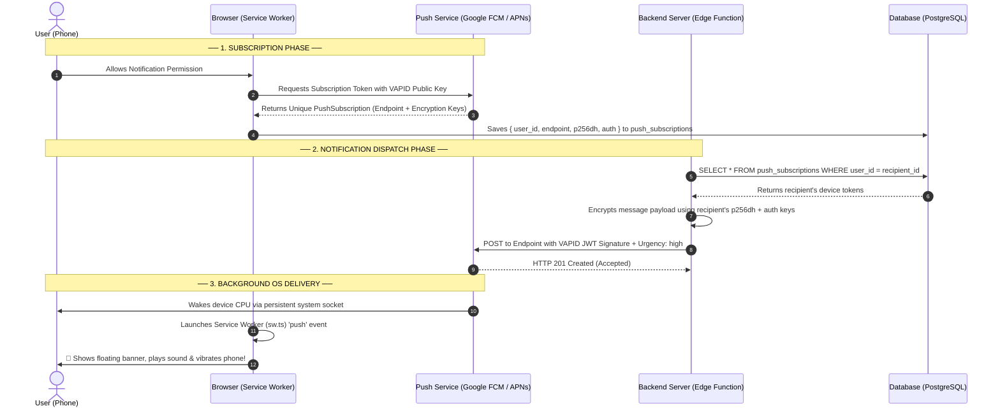
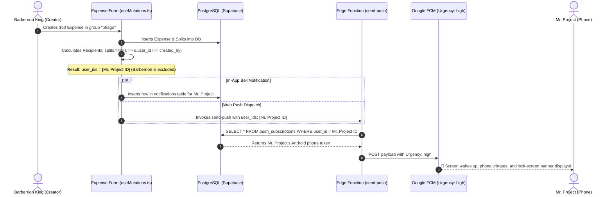

# Centfolio Web Push Notification Architecture & Technical Implementation

This document provides a comprehensive, easy-to-understand technical guide on how **Web Push Notifications** work in general, and how they are implemented across **Centfolio** (Frontend PWA, Supabase PostgreSQL, and Supabase Edge Functions).

---

## 1. Overview & Core Concepts

### What is Web Push?
Web Push allows web applications (Progressive Web Apps / PWAs) to send notifications to a user's phone, tablet, or computer **even when the browser tab is closed, the phone screen is locked, or the user is using another app** (like WhatsApp or Instagram).

### The Three-Party Push Architecture (W3C Standard)
Web push requires collaboration between **three independent entities**:

```
+------------------+         +-------------------------------+         +-----------------------+
|  Client Browser  |  <--->  |  Push Service (Gateway)       |  <--->  |  Application Backend  |
|  (PWA / Mobile)  |         |  (Google FCM / Apple APNs)    |         |  (Supabase Edge Func) |
+------------------+         +-------------------------------+         +-----------------------+
```

1. **The Client (User's Device & Service Worker)**:
   * Runs in the background on the user's phone.
   * Prompts for notification permission (`Notification.requestPermission()`).
   * Asks the browser's Push Service for a unique device address (**PushSubscription Endpoint**).
2. **The Push Service (Google FCM / Apple APNs / Windows WNS)**:
   * Maintained by the browser / operating system vendor (e.g. Google for Android/Chrome, Apple for iOS/Safari, Microsoft for Windows/Edge).
   * Maintains a low-power, persistent network socket to the device to deliver instant notifications.
3. **The Application Server (Supabase Edge Function `send-push`)**:
   * Holds the secret identity key (**VAPID Private Key**).
   * Queries recipient devices from PostgreSQL (`push_subscriptions`).
   * Signs and encrypts push messages, sending them to the Push Service.

---

## 2. Cryptographic Identity: What is VAPID?

**VAPID** (*Voluntary Application Server Identification* - RFC 8292) is the cryptographic identity of your web application.

* **Keypair (NIST P-256 Elliptic Curve)**:
  * **Public Key**: Shared with the client browser to request a subscription token from Google FCM.
  * **Private Key**: Kept strictly secret on the backend (`send-push` Edge Function) to sign outgoing notification payloads.
* **Why VAPID is Static**:
  When a user registers their device, Google FCM locks that registration to your **VAPID Public Key**. If the server's private key changes, FCM rejects all subsequent pushes with `403 Forbidden` until users re-subscribe. Therefore, VAPID keys remain constant for the lifetime of the application.

---

## 3. General Web Push Architecture (Mermaid Diagram)



---

## 4. Centfolio Implementation Architecture

In Centfolio, push notifications are architected across four modular layers:

```
┌───────────────────────────────────────────────────────────────────────────────────┐
│                                  Centfolio CLIENT                                 │
│                                                                                   │
│   ┌───────────────────────────┐                     ┌───────────────────────────┐ │
│   │   AppLayout / AuthContext │                     │   PushNotificationsCard   │ │
│   │   (Auto-Sync & Detach)    │                     │   (Toggle / Send Test)    │ │
│   └─────────────┬─────────────┘                     └─────────────┬─────────────┘ │
│                 │                                                 │               │
│                 ▼                                                 ▼               │
│   ┌─────────────────────────────────────────────────────────────────────────┐     │
│   │                 src/utils/pushNotifications.ts                          │     │
│   │                 (VAPID config, ServiceWorker resolution, Audio Chime)   │     │
│   └─────────────────────────────────────┬───────────────────────────────────┘     │
│                                         │                                         │
│                                         ▼                                         │
│   ┌─────────────────────────────────────────────────────────────────────────┐     │
│   │                       src/sw.ts (Service Worker)                        │     │
│   │                       (Background Push Event & Notification Click)      │     │
│   └─────────────────────────────────────────────────────────────────────────┘     │
└─────────────────────────────────────────┬─────────────────────────────────────────┘
                                          │
                                          ▼
┌───────────────────────────────────────────────────────────────────────────────────┐
│                                  SUPABASE BACKEND                                 │
│                                                                                   │
│   ┌───────────────────────────────┐             ┌─────────────────────────────┐   │
│   │  push_subscriptions table     │             │  notifications table        │   │
│   │  (Device endpoints & keys)    │             │  (In-app notification bell) │   │
│   └───────────────┬───────────────┘             └──────────────┬──────────────┘   │
│                   │                                            │                  │
│                   └──────────────────────┬─────────────────────┘                  │
│                                          │                                        │
│                                          ▼                                        │
│   ┌─────────────────────────────────────────────────────────────────────────┐     │
│   │                   supabase/functions/send-push/index.ts                 │     │
│   │                   (Deno Runtime, web-push v3.6.7, Urgency: high)        │     │
│   └─────────────────────────────────────────────────────────────────────────┘     │
└───────────────────────────────────────────────────────────────────────────────────┘
```

---

## 5. Component Breakdown

### A. Frontend Utilities & Service Worker

| File | Role & Responsibilities |
| :--- | :--- |
| [`src/sw.ts`](file:///C:/PersonalWork/Projects/expense-tracker/split-wisely/src/sw.ts) | **Background Service Worker**: Listens to the `push` event, formats notification titles/bodies, enforces `silent: false` and `vibrate: [300, 100, 300, 100, 300]`, and handles `notificationclick` navigation to the target group/expense. |
| [`src/utils/pushNotifications.ts`](file:///C:/PersonalWork/Projects/expense-tracker/split-wisely/src/utils/pushNotifications.ts) | **Client Push Engine**: Handles permission requests, converts VAPID base64 keys into `Uint8Array`, registers Service Worker (`navigator.serviceWorker.ready`), executes client-side Web Audio chimes (`playNotificationChime()`), and exports `syncPushSubscriptionWithBackend()`. |
| [`src/utils/pushDispatcher.ts`](file:///C:/PersonalWork/Projects/expense-tracker/split-wisely/src/utils/pushDispatcher.ts) | **Fail-Safe Dispatch Helper**: Invokes the `send-push` Edge Function with target `userIds`. Errors are safely caught so transactional workflows (like creating expenses) never fail even if push services are unreachable. |
| [`src/layouts/AppLayout.tsx`](file:///C:/PersonalWork/Projects/expense-tracker/split-wisely/src/layouts/AppLayout.tsx) | **Auto-Sync Hook**: Automatically registers/claims the current device's push token on login without requiring the user to navigate to Settings. |
| [`src/context/AuthContext.tsx`](file:///C:/PersonalWork/Projects/expense-tracker/split-wisely/src/context/AuthContext.tsx) | **Clean Disassociation**: Calls `detachPushSubscriptionOnLogout()` on `signOut` to prevent cross-account ghost notifications. |

---

### B. Database Schema & RLS Policies

#### 1. `push_subscriptions` Table
Stores each physical device's push credentials:
```sql
CREATE TABLE public.push_subscriptions (
  id UUID PRIMARY KEY DEFAULT gen_random_uuid(),
  user_id UUID NOT NULL REFERENCES auth.users(id) ON DELETE CASCADE,
  endpoint TEXT NOT NULL UNIQUE,
  p256dh TEXT NOT NULL,
  auth TEXT NOT NULL,
  user_agent TEXT,
  created_at TIMESTAMPTZ NOT NULL DEFAULT NOW(),
  updated_at TIMESTAMPTZ NOT NULL DEFAULT NOW()
);

-- Row Level Security (RLS)
ALTER TABLE public.push_subscriptions ENABLE ROW LEVEL SECURITY;

CREATE POLICY "Users can manage their own subscriptions"
  ON public.push_subscriptions FOR ALL
  USING (auth.uid() = user_id)
  WITH CHECK (auth.uid() = user_id);
```

#### 2. `notifications` Table
Stores persistent in-app notifications (powers the header bell dropdown and real-time WebSocket channel):
```sql
CREATE TABLE public.notifications (
  id UUID PRIMARY KEY DEFAULT gen_random_uuid(),
  user_id UUID NOT NULL REFERENCES auth.users(id) ON DELETE CASCADE,
  actor_id UUID REFERENCES auth.users(id) ON DELETE SET NULL,
  type TEXT NOT NULL,
  title TEXT NOT NULL,
  message TEXT NOT NULL,
  link TEXT,
  is_read BOOLEAN NOT NULL DEFAULT FALSE,
  metadata JSONB DEFAULT '{}'::jsonb,
  created_at TIMESTAMPTZ NOT NULL DEFAULT NOW()
);
```

---

### C. Backend Edge Function: `send-push`

Located at [`supabase/functions/send-push/index.ts`](file:///C:/PersonalWork/Projects/expense-tracker/split-wisely/supabase/functions/send-push/index.ts):
* **Runtime**: Deno on Supabase Edge Network.
* **Module**: `npm:web-push@3.6.7`.
* **Execution Flow**:
  1. Accepts `{ user_ids, title, message, url, tag }`.
  2. Queries `push_subscriptions` using `supabaseAdmin` (bypassing RLS with service role credentials).
  3. Formats payload and signs it using `webpush.setVapidDetails()`.
  4. Passes `{ urgency: "high", TTL: 86400 }` to `webpush.sendNotification()` to bypass Android Doze mode.
  5. **Auto-Prunes Dead Devices**: If FCM/APNs returns `404 Not Found` or `410 Gone`, it automatically removes the stale endpoint from the database.

---

## 6. End-to-End Action Lifecycles

### Lifecycle 1: Adding an Expense (Strict Recipient Targeting)



---

### Lifecycle 2: All Event Triggers Across Centfolio

| Trigger Event | Originating Component | Recipient Targeted | Notification Title & Message |
| :--- | :--- | :--- | :--- |
| **Add Expense** | [`useMutations.ts`](file:///C:/PersonalWork/Projects/expense-tracker/split-wisely/src/hooks/supabase/useMutations.ts) | All split members (except creator) | `New Expense Added` — *"An expense 'Dinner' was added."* |
| **Edit Expense** | [`useMutations.ts`](file:///C:/PersonalWork/Projects/expense-tracker/split-wisely/src/hooks/supabase/useMutations.ts) | All split members (except editor) | `Expense Updated ✏️` — *"Expense 'Dinner' was updated."* |
| **Payment Reminder** | [`FriendDetailPage.tsx`](file:///C:/PersonalWork/Projects/expense-tracker/split-wisely/src/pages/FriendDetailPage.tsx) | Debtor Friend | `Payment Reminder ⏰` — *"Barberrion sent a payment reminder for $50.00."* |
| **Record Payment** | [`SettleUpModal.tsx`](file:///C:/PersonalWork/Projects/expense-tracker/split-wisely/src/components/SettleUpModal.tsx) | Payee (Recipient) | `Payment Received 💰` — *"Barberrion recorded a payment of $50.00 to you."* |
| **Add Direct Friend** | [`AddFriendModal.tsx`](file:///C:/PersonalWork/Projects/expense-tracker/split-wisely/src/components/AddFriendModal.tsx) | Friend Added | `New Friend Added 🤝` — *"Barberrion added you as a friend."* |
| **Add Group Member** | [`GroupMembersDrawer.tsx`](file:///C:/PersonalWork/Projects/expense-tracker/split-wisely/src/components/group/GroupMembersDrawer.tsx) | New Member | `Added to Group 👥` — *"Barberrion added you to the group 'bhago'."* |
| **Join via Invite Link** | [`JoinGroupPage.tsx`](file:///C:/PersonalWork/Projects/expense-tracker/split-wisely/src/pages/JoinGroupPage.tsx) | Group Inviter | `New Member Joined 👥` — *"Mr. Project joined 'bhago'."* |

---

## 7. Key Invariants & Troubleshooting Reference

1. **Actor Suppression**:
   * The actor who triggers an event (`actor_id`) is strictly excluded from `userIds` dispatched to the push pipeline and suppressed in real-time WebSocket listeners (`if (newNotif.actor_id === user.id) return;`).
2. **High-Priority Delivery (RFC 8030)**:
   * `{ urgency: "high", TTL: 86400 }` is passed on every push dispatch to prevent Android Doze mode from deferring notifications when the screen is locked or while using other applications.
3. **Multi-Device Support**:
   * A user can have multiple registered devices (e.g. Android phone, iPad, laptop). The `send-push` Edge Function queries all active devices for that `user_id` and broadcasts simultaneously.
4. **Vibration Controls on Android**:
   * From Android 8.0 through Android 15, physical vibration is governed by **Android System Notification Channels** (`Settings -> Apps -> Chrome -> Notifications -> Sites`). In `sw.ts`, `silent: false` and `vibrate: [300, 100, 300, 100, 300]` ensure the browser requests full sound and haptic alerts.
